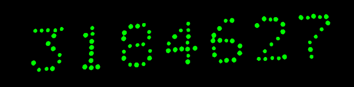
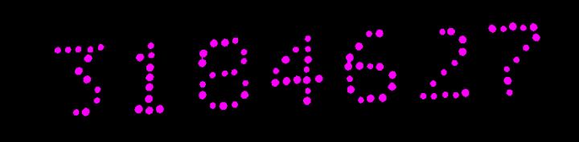
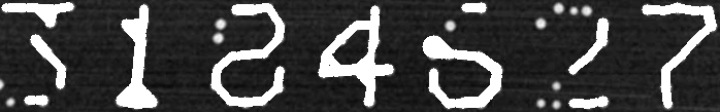

# Dot Matrix OCR

**Live demo: <https://dot-matrix-ocr.vercel.app/>**

Reads dot-matrix and laser-engraved digits off metal surfaces. A classical
OpenCV pipeline cleans and reconstructs the scattered dots into connected
glyphs, then a vision model reads the result.

No image of your own? The demo offers three sample plates to try. The first
request after a quiet spell takes about a minute — the free backend sleeps and
has to wake up.

| | URL |
| --- | --- |
| Frontend (Vercel) | <https://dot-matrix-ocr.vercel.app/> |
| Backend API (Render) | <https://dot-matrix-ocr.onrender.com> |
| API docs | <https://dot-matrix-ocr.onrender.com/docs> |
| Health check | <https://dot-matrix-ocr.onrender.com/health> |

The project runs two ways, from one codebase:

| | Local | Deployed |
| --- | --- | --- |
| How | `python app.py` — one server, one port | frontend on Vercel, backend on Render |
| UI ↔ API | same origin, no CORS | HTTPS across origins, CORS + `API_BASE_URL` |
| Cold start | none | ~50s after 15 min idle (Render free) |

## Layout

```
app.py        Local launcher — serves frontend/ and backend/ as one app
README.md     This file
.gitignore

frontend/     Static UI → Vercel
  index.html  styles.css  script.js
  config.js         generated — do not edit
  generate-config.js  bakes .env into config.js (Vercel's build command)
  .env  .env.example   API_BASE_URL, WAKE_BACKEND, MAX_UPLOAD_MB
  vercel.json  .vercelignore
  Dockerfile  .dockerignore  nginx.conf  docker-compose.yml  README.md

backend/      FastAPI + OpenCV API → Render (Docker, free tier)
  app.py  requirements.txt
  .env  .env.example    OPENROUTER_API_KEY, OCR_MODEL, ALLOWED_ORIGINS, ...
  Dockerfile  .dockerignore  docker-compose.yml
  render.yaml           Render service spec
  .gitattributes        Git LFS rules for the model weights below
  setup_local.ps1  README.md
  ocr/                  YOLO training, dataset, weights — research only
```

`backend/ocr/` sits with the backend because it is the same Python/ML side of
the project, but it is **not deployed**: `backend/.dockerignore` excludes it, so
its 33 MB of dataset and weights never enter the image. `backend/app.py` imports
none of it.

## Run everything locally

```bash
pip install -r backend/requirements.txt
cp backend/.env.example backend/.env      # then add your OPENROUTER_API_KEY
python app.py
```

Open <http://localhost:8000>. The UI, the API, and `/docs` are all on that one
port, so there is no CORS and nothing to configure — `API_BASE_URL` is empty by
default, which makes the page call its own origin.

```bash
python app.py --port 5000     # different port
python app.py --reload        # restart on file changes
python app.py --host 0.0.0.0  # reachable from your phone on the same wifi
```

Prefer the split setup locally (closer to production, needs Docker):

```bash
docker compose -f backend/docker-compose.yml -f frontend/docker-compose.yml up --build
# UI http://localhost:8080   API http://localhost:10000
```

## Pipeline

The dots are never read directly. They are cleaned, filtered, straightened and
joined into solid glyphs first, and only that reconstruction is shown to the
vision model. Every stage below is also returned to the UI, so when a read comes
out wrong you can see exactly which step lost it.

Run these yourself with `python backend/tests/make_pipeline_docs.py`.

### 1. Original

The photo as uploaded: dot-peen digits on steel, lit unevenly, slightly tilted.


### 2. Illumination correction

Dividing by a heavy Gaussian blur removes the lighting gradient while keeping
the dots. Without this, a single threshold cannot serve both the bright and the
dark end of the plate.


### 3. Threshold

A fixed binary threshold plus a morphological close, now that the lighting is
flat. The dots survive; so does some surface grain.


### 4. Connected components

Each blob is measured and anything too small to be a dot is discarded. What
remains (green) is dot-shaped, but includes marks that are not part of the text.



### 5. DBSCAN

Clustering the blob centroids separates the text — where dots have many close
neighbours — from isolated speckle, which is labelled noise and dropped. This is
the step that decides what counts as writing.



### 6. Deskew

`minAreaRect` measures the tilt of the surviving dots, the image is rotated flat
and cropped to the text.


### 7. Join the dots

A vertical projection splits the line into digit blocks, then tapered lines
connect neighbouring dots inside each block, turning a scatter of dots into
strokes a vision model can read.



### 8. Read

The reconstruction goes to a vision model via OpenRouter. That step tries every
configured API key, then every fallback model, before backing off — free-tier
keys and models are rate-limited independently, so a failure on one rarely means
a failure on the next.

### Where it goes wrong

Most bad reads are lost before the model ever sees the image. Compare stage 7
against the plate: if a digit is malformed or missing there, no model will
recover it. On the `gas-cylinder` sample, for instance, vignetting dims the
right-hand edge enough that DBSCAN drops the final `0`, and the read comes back
six digits instead of seven. That is a tuning problem in steps 3-5, not a model
problem.

## Deploying

Order matters — the frontend needs the backend's URL, and the backend needs the
frontend's origin for CORS.

1. **Backend → Render.** [backend/README.md](backend/README.md). New Web
   Service, Root Directory `backend`, Runtime `Docker`, Instance Type `Free`,
   Health Check Path `/health`. Set `OPENROUTER_API_KEY`. Copy the resulting
   `https://<name>.onrender.com`.
2. **Frontend → Vercel.** [frontend/README.md](frontend/README.md). Import the
   repo with Root Directory `frontend`, and set `API_BASE_URL` to the Render URL
   in the project's Environment Variables. The build command bakes it into
   `config.js`.
3. **Close the loop.** Set `ALLOWED_ORIGINS` on Render to your Vercel domain and
   redeploy the backend.

## What the free tier costs you

Every feature works on Render's free plan — nothing is disabled. Three
operational limits are worth knowing, and the code already accounts for each:

| Limit | Effect | What the code does |
| --- | --- | --- |
| Sleeps after ~15 min idle | First request takes ~50s | The page pings `/health` on load and tells the user the server is waking, instead of freezing the progress bar |
| 512 MB RAM, 0.1 CPU | Large images are slow | One uvicorn worker (more OOMs the instance); the UI rejects files over `MAX_UPLOAD_MB` before uploading |
| Ephemeral disk, no volume | Nothing persists between deploys | Intermediate images are returned inline as base64 and the session directory is deleted immediately, so nothing needs to persist |

Locally none of these apply: no sleep, your full CPU and RAM, and
`KEEP_UPLOADS=1` in `backend/.env` keeps every intermediate image on disk under
`backend/uploads/` for inspection.
